<h1>Help</h1>

## Table of Contents 

* <a href="#settings">Settings</a>
 * <a href="#settings-configuration">Configuration</a>
 * <a href="#settings-options">Options</a>
 * <a href="#settings-upload">Upload Manager</a>
* <a href="#quick-start">Quick Start</a>
 * <a href="#quick-start-about">About the Uploader</a>
 * <a href="#quick-start-drag">Drag and drop an ingest</a>
 * <a href="#quick-start-metadata">Specify metadata</a>
 * <a href="#quick-start-submit">Submit</a>
* <a href="#collections">Collections</a>
 * <a href="#collections-about">About collections</a>
 * <a href="#collections-refresh">Refreshing the collection list</a>
 * <a href="#collections-info">Collection info</a>
* <a href="#ingests">Ingests</a>
    * <a href="#ingests-list">Ingest list</a>
    * <a href="#ingests-add">Adding an ingest</a>
    * <a href="#ingests-actions">Ingest actions</a>
        * <a href="#ingests-actions-metadata">Metadata</a>
        * <a href="#ingests-actions-submit">Submit</a>
        * <a href="#ingests-actions-upload">Upload</a>
        * <a href="#ingests-actions-cancel">Cancel</a>
        * <a href="#ingests-actions-delete">Delete</a>
    * <a href="#ingests-upload-status">Upload status</a>
* <a href="#ingest">Ingest details</a>
 * <a href="#ingest-info">Ingest info</a>
 * <a href="#ingest-list">File list</a>
 * <a href="#ingest-actions">Ingest actions</a>
 * <a href="#ingest-file-actions">File actions</a>
* <a href="#advanced">Advanced Features</a>
 * <a href="#advanced-folders">Uploading folders</a>

## Settings
When you first open the Uploader, you will be taken to the Settings screen to configure the Uploader as described below. To come back to the settings screen at any time, click the Settings menu option.

### Configuration
The uploader uses several configuration settings that can be retrieved from Alma.

* The institution code is the code provided when logging, for example 01MYUNIV_INST
* The storage access key and secret can be retrieved in Alma by goung to Resource Management Configuration, General, Digital Storage Keys.
* The storage location should be selected based on your Alma region.

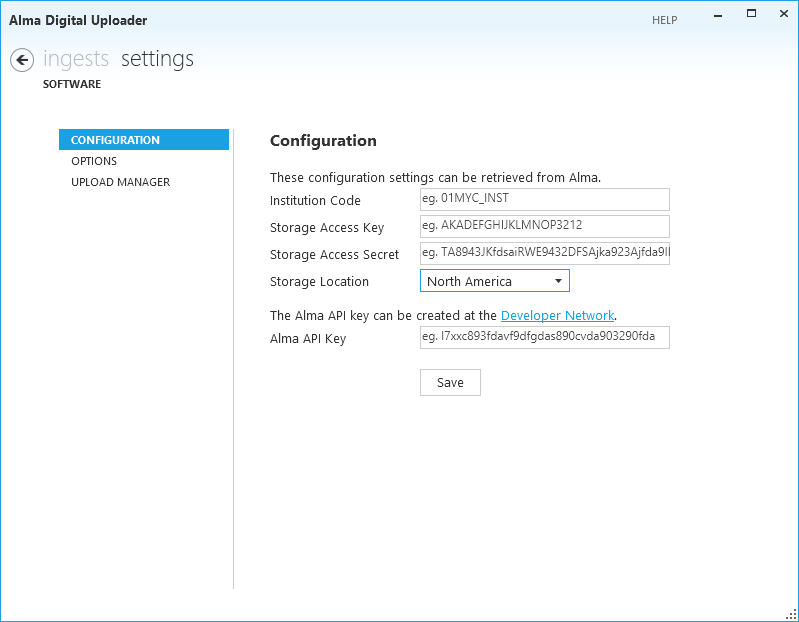

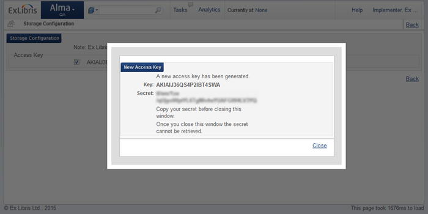

The API key can be created in the <a href="https://developers.exlibrisgroup.com/" target="_blank">Developer Network</a>. You can create an application with any name you choose, and select the Configuration API and production read/write (write access needed to execute an import profile). (Details on how to create an application are available <a href="https://developers.exlibrisgroup.com/alma/apis/" target="_blank">here</a>.)

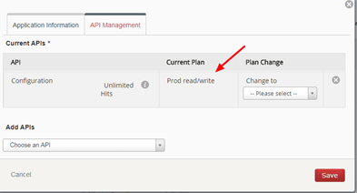

When you've filled out all of the configuraiton settings, click the Save button. The settings will be tested and if successful saved to your local configuration. If an error is reported, check the values provided and try again.

### Options
You can control how the Uploader behaves with the following options:

* Upload files- specifies whether files are immediately queued for upload when added. Default is manual, which means you need to manually select files or ingests to begin uploading
* Submit ingests- specifies whether ingests are submitted as soon as uploading is complete and metadata is provided. Select "when ready" if you will be uploading prepared ingests, select "manually" if you need to manage the ingests before they are submitted for processing. Default is manual, which means you need to manually submit ingests when they are ready.
* Upload thumbnails- specifies whether thumbnails should be uploaded when available. Default is off, since Alma produces thumbnails automatically

### Upload Manager
Using this screen, you can control the upload manager, which handles the uploading of the files. Specify the number of simultaneous uploads you wish to perform (default 3), or pause the upload manager to temporarily prevent additional files from being uploaded.

<a href="#toc">Top</a>

## Quick Start

### <a id="quick-start-about"></a>About the Uploader
The Uploader works according to the conventions specified by the Alma Digital module to make ingests available for processing by Alma. The workflow is as follows:

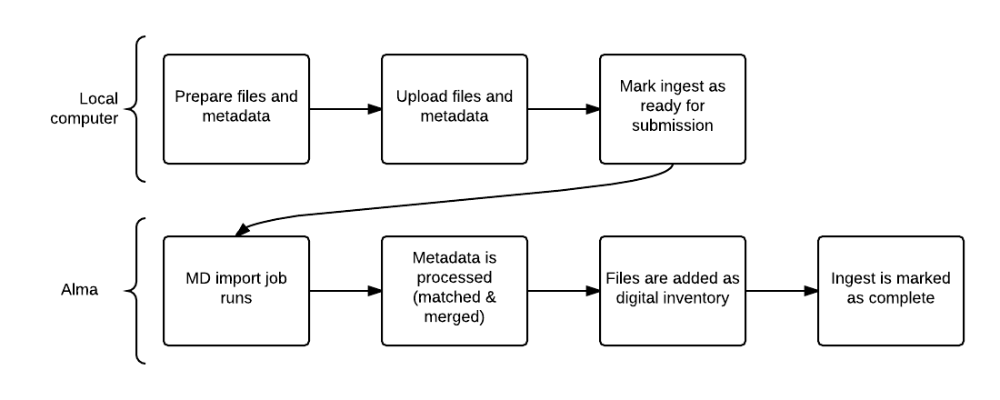

### Drag and drop an Ingest
To add an ingest, <a href="#ingests-add">drag and drop</a> a prepared folder onto the ingest list. An ingest will be created and the files contained in the folder (and all subfolders) will be prepared for upload. If you've configured automatic uploads, the files will begin to upload immediately.

### Specify Metadata
An Alma Digital ingest requires metadata. The metadata format is configured in the MD Import profile (see <a href="#ingests-actions-metadata">below</a>). If you have a metadata file prepared (from another system, for example), you can add the metadata file like any other file, with the name specified in the MD Import profile. If you don't have prepared metadata, you can use the basic "quick catalog" form to add minimal metadata.

### Submit the ingest
When the files have been uploaded and the metadata added, <a href="#ingests-actions-submit">mark the ingest</a> as ready for submission. This will indicate to the MD import job to work on the ingest the next time it's run.

That's all there is to it- you've successfully used the Alma Digital Uploader to add files to your Alma Digital repository.

<a href="#toc">Top</a>

## Collections

### About collections
Ingests are uploaded into Alma based on collections. A bit of background into how Alma processes digital ingests is required. In Alma, we can configure a metadata import profile of type digital. As a part of the MD import profile, we define the metadata format, metadata file name, and the collection to which the matched/created BIBs will be added. Collections are hierarchical folders which are used to categorize BIBs, and are required for BIBs with digital inventory.

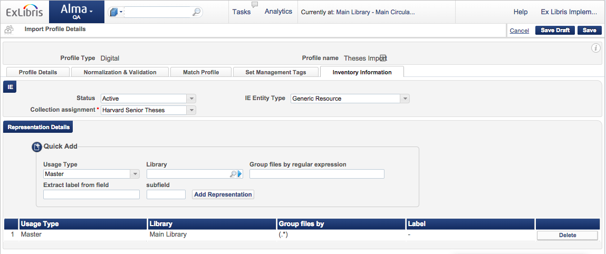

The Uploader retrieves from Alma a list of digital MD import profiles. The list is displayed in the drop down box showing the name of the collection, and the MD import profile name in parentheses (to differentiate in cases where are multiple import profiles with the same collection defined.)

Ingests are uploaded into a particular collection, and are processed by the MD import job associated with the selected collection. To upload into a different collection, select the collection name from the drop down. The ingest list updates to display only those associated with the selected collection.

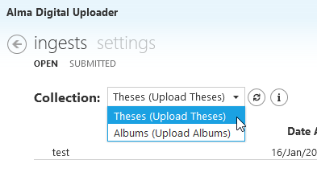

### Refreshing the collection list
If you've updated your MD import profiles in Alma and you want to refresh the list of collections in the Uploader, click the refresh button next to the collection list.

### Collection info
To see basic information about the collection, including metadata format and the expected metadata file name, click the info icon next to the collection list.

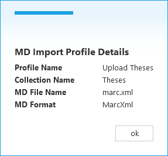

### Trigger MD Import
Triggers an execution of the import job in Alma.

<a href="#toc">Top</a>

## Ingests

### Ingest list
To reach the ingest list, click the Ingests menu item from anywhere in the application. The ingest list shows all of the non-submitted ingests, including the following information:

* Ingest name
* Date added
* Number of files
* Size of files
* Ingest status
* Progress, if uploading

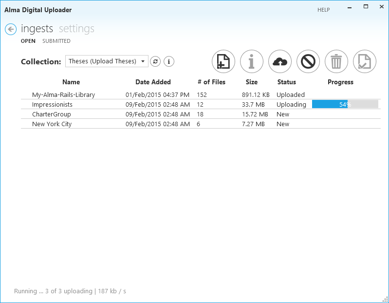

### Adding an ingest
There are two ways to add an ingest:

* *Add ingest button*: Click the *Add Ingest* button and select the folder/s you wish to upload. Only folders are allowed to be added as ingests. A new ingest will be created for each folder selected.
* *Drag and drop*: In Windows Explorer, select the folder/s you wish to upload and drag them over the ingest list. A new ingest will be created for each folder selected.

### Ingest actions
There are several actions which can be performed on ingests from the ingest list screen.

#### Metadata
Currently the digital metadata import process in Alma supports one BIB per ingest. Metadata must be provided for each ingest. The MD import job performs a match/merge process based on the metadata provided with the ingest. The metadata must be formatted and the file must be named as specified in the MD import profile (and displayed in the <a href="#collections-info">collection info</a> screen).
If your ingest was prepared with a metadata file, then the ingest is ready for processing once all of the files are uploaded. If there was no metadada provided, you can use the quick catalog form to add very basic metadata. Select the desired ingest and click the <i>Ingest metadata</i> button and fill out the fields. WHen the ingest is marked as submitted, the Uploader will create a metadata file in the correct format and name and populate it with the information specified.

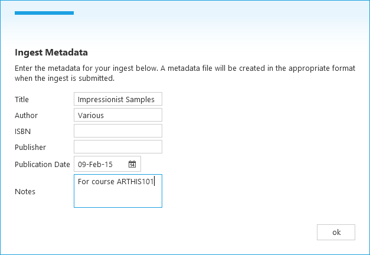

#### Submit
When all of the ingest files are uploaded and the metadata is prepared, your ingest is ready to be processed. Select the desired ingest and click the <i>Submit</i> button. (If you've configured "Submit when ready" in <a href="#settings-options">options</a>, the ingest will be submitted as soon as the files are uploaded and the metadata is provided. Once submitted, the ingest will be marked as ready for processing by the metadata import job the next time it's run.

After submission, the ingest is moved to the <i>Submitted</i> tab in the ingest list. It includes the date and time that it was submitted for processing.

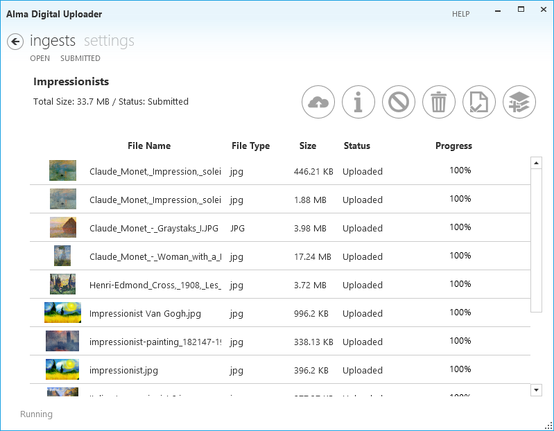

<h4>
<a id="ingests-actions-upload" class="anchor" href="#ingests-actions-upload" aria-hidden="true"></a>Upload</h4>

To upload the files in an ingest, select the desired ingest/s and click the <i>Upload</i> button.  (If you've configured "Upload when added" in <a href="#settings-options">options</a>, files will be uploaded as soon as they're added to the ingest. Upload progress is shown in the ingest list. If you wish to upload all files, click the <i>Upload</i> button when no ingest is selected. 

#### Cancel
To cancel any uploads in progress, select the desired ingest/s and click the <i>Cancel</i> button. If you wish to cancel all uploading files, click the <i>Cancel</i> button when no ingest is selected.

#### Delete
You can delete an entire ingest, including metadata, files, and any files which have already been uploaded to Alma. Select the desired ingest/s and click the <i>Delete</i> button.

### Upload status
An upload status summary appears in the bottom left corner of the ingest screen. The status includes whether the upload manager is running, how many files are currently being uploaded, how may are queued for upload, and the total bandwidth being used. Double click the upload status to open the <a href="#settings-upload"><i>Upload Manager Settings</i></a> screen.

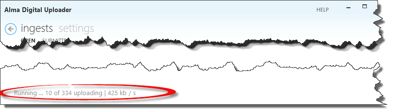

<a href="#toc">Top</a>

## Ingest Details
To view and ingest's details, double click the ingest in the ingest list.

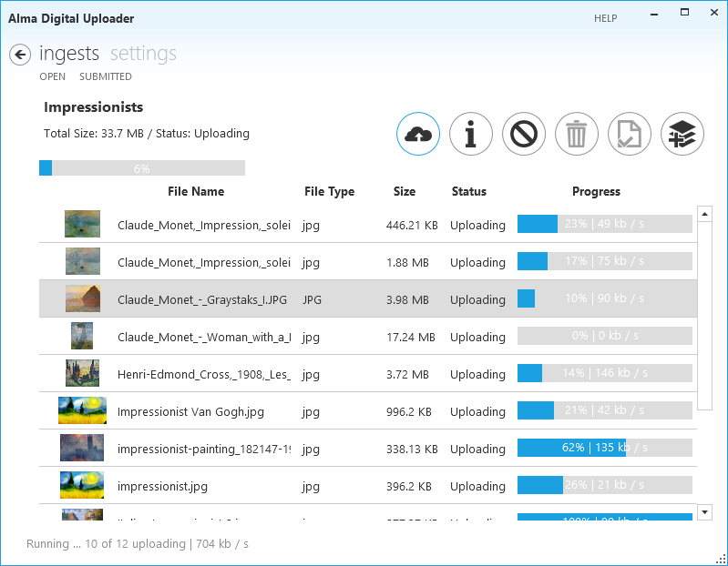

### Ingest information
Ingest details are displayed in the top left of the screen, including:

* ingest name
* total size
* status
* upload progress

### File list
A list of all files in the ingest is displayed, with the following information about each file:

* Thumbnail
* File name (including directoy)
* File type
* Size
* Status- new, uploading, waiting, uploaded
* Progress

### Ingest actions
There are several actions which can be performed on the ingest from the ingest details screen:

* To add files to the ingest, click the <i>Add files</i> button. You can select files or folders to add to the ingest
* To add metadata to the ingest, click the <i>Ingest metadata</i> button. See <a href="#ingests-actions-metadata">above</a> for more information.
* To submit the ingest for processing, click the <i>Submit</i> button. See <a href="#ingests-actions-submit">above</a> for more information.

### File actions
There are several actions which can be performed on the files from the ingest details screen:

* To upload the files in an ingest, select the desired file/s and click the <i>Upload</i> button.  (If you've configured "Upload when added" in <a href="#settings-options">options</a>, files will be uploaded as soon as they're added to the ingest. Upload progress is shown in the ingest details. If you wish to upload all files, click the <i>Upload</i> button when no ingest is selected.
* To cancel any file uploads in progress, select the desired file/s and click the <i>Cancel</i> button. If you wish to cancel all uploading files, click the <i>Cancel</i> button when no files are selected.
* You can delete files in the ingest, including removing from Alma if they've already been uploaded. Select the desired file/s and click the <i>Delete</i> button.

<a href="#toc">Top</a>

  

## Advanced Features

### Uploading folders
Digital representations in Alma Digital are flat. However, the Uploader maintains folder structure when uploading. The metadata import job will create inventory from all files in all sub-folders. You can configure Alma to create digital representations based on a sub-folder structure. For example, you can put high resolution images in one folder and low resolution in another. The uploader shows the folder structure in the file list.

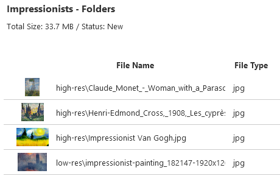

<a href="#toc">Top</a>

 
 
 
 
 
 
 